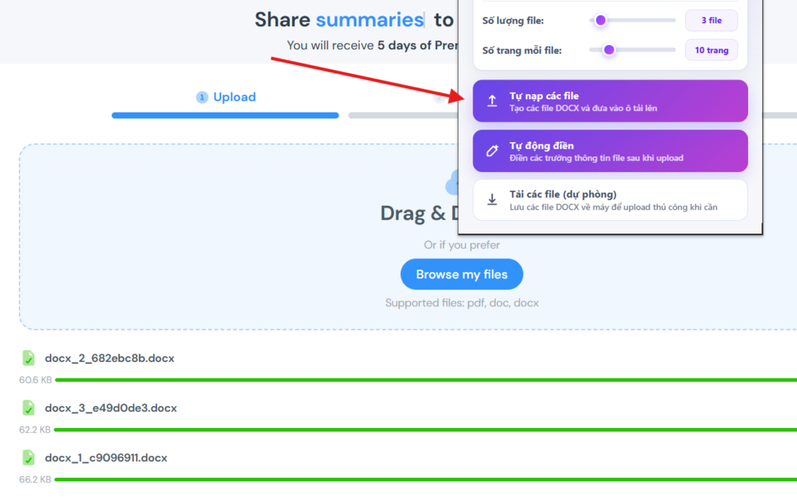
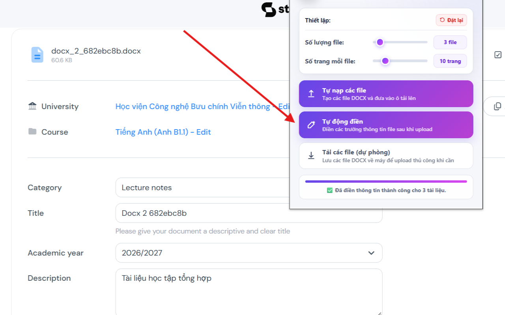

# [Studocu Premium Helper](https://github.com/nvbangg/Studocu-Premium-Helper)

Extension hỗ trợ tự động tạo và nạp tài liệu kích hoạt nhanh Studocu Premium

## ✨ Tính năng

- **Tạo và nạp tài liệu tự động:** Tự động tạo các file DOCX hợp lệ và nạp trực tiếp vào trang upload của Studocu.
- **Tự động điền form:** Tự nhận diện và hoàn thiện đầy đủ các trường thông tin (Trường học, Môn học, Danh mục, Năm học, Tiêu đề và Mô tả).
- **Tải DOCX về máy:** Hỗ trợ tùy chỉnh số lượng tài liệu, số trang và tải về máy dạng từng file riêng lẻ hoặc đóng gói file ZIP.

## ⬇️ CÀI ĐẶT

---

## ℹ️ About

<i>

Maintained with ❤️ by **[@nvbangg](https://github.com/nvbangg)**

</i>

### ⚖️ Privacy Policy

- This project does not collect any data of any kind
